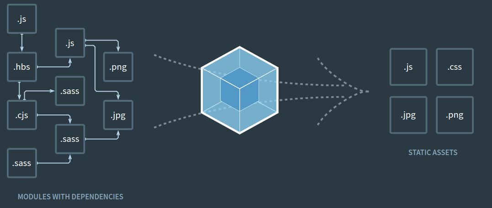

# Webpack

At its core, webpack is a static module bundler for modern JavaScript applications.

When webpack processes your application, it internally builds a dependency graph which maps every module your project needs and generates one or more bundles.

## Table of contents
-[Install Webpack](#install-webpack)

## Install Webpack

### `npm install --save-dev webpack`

Install Webpack with npm.

### `yarn add webpack --dev`

Install Webpack with yarn.
